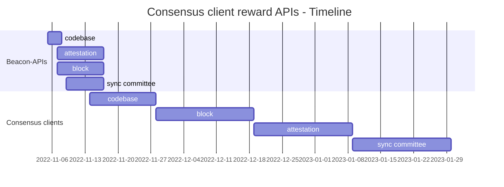

# [Consensus client reward APIs](/projects/project-ideas.md#consensus-client-reward-apis)

**Implement APIs to fetch `per-validator rewards`**

Collaboration between [`naviechan`](https://github.com/naviechan) and [`kevinbogner`](https://github.com/kevinbogner) under the mentorship of [`sproul`](https://github.com/michaelsproul).

## Motivation

The Ethereum Merge joined the original execution layer with its new proof-of-stake *consensus layer*, the beacon chain. In the beacon chain, validators are rewarded for behaving according to the protocol. [*Altair*](https://github.com/ethereum/consensus-specs/tree/dev/specs/altair), the first upgrade of the beacon chain, redefined the way of allocating rewards and penalties.

Currently, there are *no* APIs to calculate the rewards paid to validators for fulfilling their duties.
This hinders the development of tools like block explorer and GUIs, requiring the devs to reverse engineer to get some data on rewards paid to validators.

What problem is your project is solving? Why is it important and what area of the protocol will be affected?

## Project description

Within this project, we propose `per-validator reward` endpoints to the [beacon-APIs](https://github.com/ethereum/beacon-APIs).

The [Ethereum beacon-APIs](https://github.com/ethereum/beacon-APIs) is a collection of RESTful APIs and aims to *enhance interoperability* across beacon node implementations. The APIs are designed to be *minimal* and *generic* to support a wide range of use cases.

Once the API endpoints are merged, we implement those APIs in one or more consensus clients.

What is your proposed solution? 

## Specification

There are *three* main activities validators are getting paid for:
1. Making *attestations*, which consist of three votes, each vote can be rewarded if they are subject to the conditions:
    - voting for a *source* checkpoint,
    - voting for a *target* checkpoint,
    - voting for a chain *head* block.
1. *Proposing blocks* in the beacon chain.
1. Participating in *sync committees*.

These three reward types must be separately designed and implemented in both the [beacon-APIs](https://github.com/ethereum/beacon-APIs) and the consensus clients:

---

`/eth/v1/beacon/attestations/{epoch}/rewards`

*Get attestation rewards*

```json
{
  "data": [
    {
      "validator_index": 0,
      "head": 2000,
      "target": 4000,
      "source": 4000
    }
  ]
}
```

---

`/eth/v1/beacon/blocks/{slot}/rewards`

*Get block rewards*

```json
{
  "proposer_index": "123",
  "total": "5000",
  "attestations": "3000",
  "sync_aggregate": "2000",
  "proposer_slashings": "0",
  "attester_slashings": "0",
}
```
---

`/eth/v1/beacon/blocks/{block_id}/sync_committee_rewards`

*Get sync committee rewards*

```json
{
    "data": [
        {
            "validator_index": "0",
            "reward": "-1000",
        },
        {
            "validator_index": "1",
            "reward": "1000",
        },
    ]
}
```

How will you implement your solutions? Give details and more technical information on the project.

## Roadmap



What is your proposed timeline? Outline parts of the project and insight on how much time it will take to execute them.

## Possible challenges

Timeline is hard to predict

What are the limitations and issues you may need to overcome?

## Goal of the project

What does success look like? Describe the end goal of the project, scope, state and impact for the project to be considered finished and successful.

## Resources

Provide links to repositories, PRs and other resources which constitute the project.

